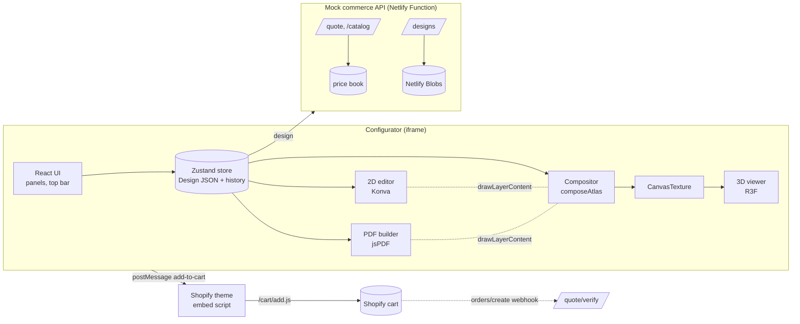

# Canopy Tent Configurator

A working replica of a custom canopy tent configurator: design each roof panel and valance in 2D, see it live on the 3D tent, get an API price, and hand the configuration, signed price and production PDF to a Shopify cart through an iframe.

**Live demo:** https://tent-configurator.netlify.app ·
**Shopify embed demo:** https://tent-configurator.netlify.app/demo-store/ ·
**Second product on the same engine:** https://tent-configurator.netlify.app/?product=backdrop-banner

React 19 · TypeScript · Three.js (React Three Fiber) · Konva · Zustand · Zod · jsPDF · Netlify Functions + Blobs

---

## What it does

| Requirement | How it is met |
| --- | --- |
| Customise sections independently | 8 panels (4 roof, 4 valance), each with its own background colour and layers. "Copy to all valances / roof panels" for the common case. |
| Text, image uploads, colours, positioning | Text (6 fonts, weight, italic, size, spacing, outline, colour), JPG/PNG/WebP/SVG uploads (validated, downscaled, hashed), swatches + hex + Pantone codes, drag / rotate / scale / nudge / reorder, undo-redo. |
| 2D editing and 3D preview, synchronised | Both views read the same design object and draw with the same function. Drag artwork in 2D *or directly on the 3D model*. Selecting a panel turns the 3D thumbnail to face it. |
| Configuration as structured data | A versioned, Zod-validated `Design` JSON (see below). Saved designs reopen with `/?design=<id>`. |
| Reusable for other products | Products are data (`ProductDefinition`). A second product, a backdrop banner, runs on the unchanged engine. |
| Responsive, reasonably optimised | Phone layout with a bottom tool sheet; models 10–11 MB → ~0.7–0.8 MB; on-demand rendering; 3D and PDF code split out of the first load. |
| Embeddable via iframe | Versioned `postMessage` protocol with origin checks, a ~3 KB theme script, a Liquid snippet, and a demo store using all of it. |
| Pricing from an API | `POST /api/quote` returns a line-by-line, HMAC-signed quote; option price hints come from `GET /api/catalog`. No price is hard-coded in the UI. |
| Shopify hand-off | Variant id + quantity + line item properties (visible summary, hidden signed quote, design id, PDF link) sent to `/cart/add.js`. |
| Production PDF | Summary with 3D renders, selections and price, print layout, per-panel artwork specs in inches (fonts, colours, DPI warnings), and the machine-readable configuration. Stored with the design so it can be linked from the order. |

## Architecture



```
src/core/          product-agnostic engine (no React, no product knowledge)
  product/         ProductDefinition contract + loader for generated model data
  design/          Design schema (Zod), factory/normalisation, pricing facts
  geometry.ts      surface frames: physical inches <-> UV atlas <-> editor
  render/          drawLayer (the one renderer), composeAtlas, hit testing
  state/           Zustand store with gesture-aware undo/redo
  pricing/         PricingService interface + HTTP client, wire types
  persistence/     DesignStore interface + HTTP client
  commerce/        CommerceAdapter (embed / ajax / preview), cart line, checkout flow
  embed/           postMessage protocol + bridge
  pdf/             production PDF
src/app/           React UI: editor, viewer, panels
src/products/      canopy-tent and backdrop-banner definitions (data only)
server/            pricing engine, price books, quote signing, design repository, router
netlify/functions/ one function mounting server/router.ts at /api/*
scripts/           model pipeline (GLB optimise + panel extraction), banner generator
shopify/           Liquid snippet, Cart Transform reference
public/embed/      theme embed script
demo-store/        Shopify-style host page with a mock cart
```

## Key technical decisions

**One design object, one renderer.** The `Design` JSON is the single source of truth. The 2D editor (a Konva custom shape's `sceneFunc`), the 3D texture compositor and the PDF all call the same `drawLayerContent()`, so the three outputs cannot drift. Sync is a property of the architecture rather than event plumbing.

**Panels are extracted from the models, not hand-traced.** `scripts/build-models.ts` finds each UV island of the print material, classifies it from its 3D normal (roof vs valance, front/right/back/left), computes the rotation that makes artwork read upright from outside the tent, asserts no island is mirrored, and measures its physical size. A new tent model is one `npm run build:models` away.

**The design lives in physical inches, not texture pixels.** Analysing the supplied UVs showed the islands are not uniformly scaled: valances are squashed 10–18% vertically. Each panel therefore has a frame in inches, mapped to the texture with a per-axis scale and to the editor with a uniform one. Round logos stay round in 2D, 3D and print, and the PDF's measurements are plain multiplication. Positions are relative to the panel, so a design survives a size change.

**Issues found in the supplied assets.** The 6.5′ model has the same 1.53 m footprint as the 5′ one (the 5′ and 8′ models are true to size in feet). The pipeline corrects its footprint on X/Z and records it. Each GLB carried unused vertex colour channels and an unreferenced texture pair, which are stripped. Models go from 10–11 MB to ~0.7–0.8 MB (meshopt geometry, WebP textures at 1024²). The baked folds in the original colour texture are kept as a 10 KB greyscale "shade" map multiplied over the print in 3D only.

**Pricing is a server concern.** The browser sends the design. The pricing function computes what is printed itself, resolves the Shopify variant (size × package), adds option prices, per-panel printing charges (first roof panel included), a rush percentage and quantity tiers, then returns line items. Quotes are HMAC-signed over id, config hash, variant, quantity, total, currency and expiry. Saving a design requires a valid, unexpired quote whose `configHash` matches that exact design. The live quote is only re-requested when a price-relevant fact changes, so dragging a logo never hits the API.

**Shopify integration.** Shopify charges the variant's price, so a configured price needs a store-side mechanism. The cart line carries the signed quote in hidden properties, which supports either:
1. **Cart Transform Function** (Plus) `lineUpdate` setting the unit price from `_quote_unit_price` (reference in `shopify/functions/cart-transform`), with an `orders/create` webhook calling `POST /api/quote/verify` to hold tampered orders (Functions can't call the network themselves).
2. **Draft Orders** created server-side from a verified quote (works on any plan).

The demo store shows the verification: its cart checks every line and flags a tampered price ("Tamper with price" button).

**Embedding.** The configurator runs on its own origin inside an iframe. Messages are namespaced (`product-configurator/v1`), sent only to the `parent_origin` from the URL, and accepted only from that origin and window. The theme script accepts messages only from the configurator origin and the iframe it created. `frame-ancestors` in `netlify.toml` lists which sites may embed it.

**Performance.** `frameloop="demand"` (no idle GPU work), one WebGL context for the app's lifetime (the canvas only changes CSS box between thumbnail and full view), texture composition coalesced to one per frame, 1024² texture on phones, DPR capped at 1.75, previews rendered off-screen at a fixed size, SVGs rasterised once, Three.js / R3F / drei lazy-loaded (first load ~219 KB gzip), jsPDF loaded only on export.

**Reusability.** A product is a `ProductDefinition`: geometry per variant (from the pipeline), surface groups and labels, options with visibility rules, declarative scene rules (`partVisibility`, `materialColor` keyed to glTF `extras.role`/`extras.part`), surface availability rules, palette, fonts and camera views. Prices live in a server price book. `?product=backdrop-banner` proves it: one or two faces depending on an option, a generated model, its own prices, and no engine changes.

## The configuration (excerpt)

```jsonc
{
  "schemaVersion": 1,
  "productId": "canopy-tent",
  "options": { "size": "8x8", "package": "canopy-frame", "frameFinish": "black", "production": "rush" },
  "quantity": 5,
  "surfaces": {
    "valance-front": {
      "fill": "#161616",
      "layers": [
        { "id": "img_…", "type": "image", "assetId": "asset_…", "x": -0.36, "y": 0, "width": 0.16, "rotation": 0, "opacity": 1, "flipX": false },
        { "id": "txt_…", "type": "text", "text": "BOOK US", "fontFamily": "Oswald", "fontWeight": 700, "fontSize": 0.055, "fill": "#ffffff", "x": 0.1, "y": 0, "rotation": 0, … }
      ]
    },
    "roof-front": { "fill": "#2647c8", "layers": [ … ] }
  },
  "assets": { "asset_…": { "name": "logo.svg", "mime": "image/svg+xml", "width": 400, "height": 160, "bytes": 2048, "sha256": "…", "src": "data:…" } },
  "notes": ""
}
```
`x`, `y` are −0.5…0.5 across the panel as seen on the tent, sizes are fractions of the panel width, and rotation is relative to upright.

## API

| Method | Path | Purpose |
| --- | --- | --- |
| GET | `/api/catalog/:productId?options={…}` | Price hints per option choice, relative to the current selection |
| POST | `/api/quote` | Signed quote `{ variant, lines[], unitPrice, total, configHash, expiresAt, signature }` |
| POST | `/api/quote/verify` | `{ valid }`: what a webhook or Function uses to trust a cart price |
| POST | `/api/designs` | Save a design with its quote (verified, must match) → `{ designId, links }` |
| PUT | `/api/designs/:id/pdf` · `/preview` | Attach the production PDF / preview image |
| GET | `/api/designs/:id` · `/pdf` · `/preview` | Reopen a design, fetch its files |

The same `handleApi(Request): Response` runs as a Netlify Function in production and as Vite middleware in development. Prices, SKUs and variant IDs are placeholders.

## Run it

```bash
npm install
npm run dev            # http://localhost:5173 (API included)
npm test               # pricing, signing, geometry and API tests
npm run build          # type-check + production build
npm run build:models   # re-run the model pipeline from assets-src/models
```

Set `QUOTE_SIGNING_SECRET` (16+ characters) in production; development uses a fixed fallback.

Embed in a theme: copy `shopify/snippets/product-configurator.liquid`, set the configurator URL, and add the shop's domain to `frame-ancestors` in `netlify.toml`.

## Not done (would be next)

- Real Shopify app: Storefront API for variant data, a deployed Cart Transform or Draft Order flow, the verification webhook.
- Original-resolution uploads to object storage via signed URLs (the demo downscales to 2400 px and keeps the hash of the original).
- Side walls (the reference sells them; they need models).
- Print-ready vector output (PDF/X with embedded fonts) rather than raster proofs.
- Undo history and drafts persisted across reloads.
